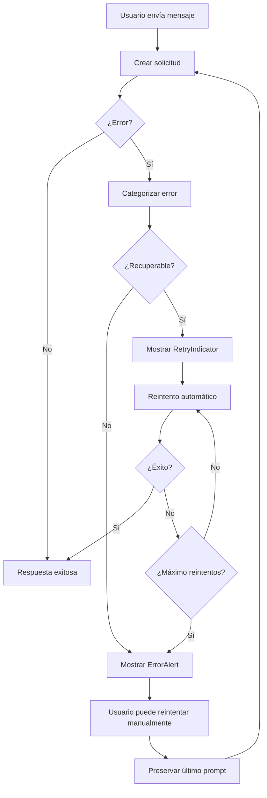

# Sistema de Manejo de Errores del Chatbot

## Descripción General

El sistema de manejo de errores del chatbot está diseñado para proporcionar una experiencia de usuario fluida y confiable, incluso cuando ocurren errores durante las consultas a la IA. El sistema incluye:

- **Detección automática de errores** con categorización inteligente
- **Reintento automático** para errores recuperables
- **Alertas contextuales** con información clara y amigable
- **Funcionalidad de reintento manual** con preservación del último prompt
- **Cancelación de solicitudes** en curso
- **Panel de pruebas** para verificar el sistema

## Componentes del Sistema

### 1. Hook `useChatAI`

**Ubicación:** `hooks/useChatAI.ts`

**Funcionalidades:**
- Gestión de estado de mensajes y streaming
- Detección y categorización automática de errores
- Reintento automático con backoff exponencial
- Cancelación de solicitudes con AbortController
- Preservación del último prompt para reintentos

**Configuración:**
```typescript
const {
  messages,
  isStreaming,
  error,
  retryCount,
  lastPrompt,
  sendMessage,
  retryLastMessage,
  cancelRequest,
  clearError,
} = useChatAI({
  maxRetries: 3,        // Número máximo de reintentos
  retryDelay: 1000,     // Delay base entre reintentos (ms)
  onError: (error) => {}, // Callback para errores
  onSuccess: (message) => {}, // Callback para éxito
});
```

### 2. Componente `ErrorAlert`

**Ubicación:** `components/dashboard/ErrorAlert.tsx`

**Características:**
- Alertas visuales con Material UI
- Botón de reintento integrado
- Visualización del último prompt
- Opción de descarte
- Información contextual sobre el error

**Props:**
```typescript
interface ErrorAlertProps {
  error: string | null;
  onRetry: () => void;
  onDismiss?: () => void;
  lastPrompt?: string;
  showRetry?: boolean;
}
```

### 3. Componente `RetryIndicator`

**Ubicación:** `components/dashboard/RetryIndicator.tsx`

**Funcionalidades:**
- Indicador visual de reintentos automáticos
- Barra de progreso del estado de reintento
- Contador de reintentos restantes
- Botón para cancelar reintentos automáticos

### 4. Panel de Pruebas `ErrorTestPanel`

**Ubicación:** `components/dashboard/ErrorTestPanel.tsx`

**Propósito:**
- Simulación de diferentes tipos de errores
- Verificación del sistema de manejo de errores
- Pruebas de reintento automático

**Tipos de errores simulados:**
- `network`: Error de conexión de red
- `rate_limit`: Límite de velocidad excedido
- `server_error`: Error interno del servidor
- `timeout`: Timeout de la solicitud

## Tipos de Errores

### Errores Recuperables (Auto-retry habilitado)

1. **Errores de Red** (`NETWORK_ERROR`)
   - Causa: Problemas de conectividad
   - Comportamiento: Reintento automático
   - Mensaje: "Error de conexión. Verifica tu conexión a internet."

2. **Rate Limiting** (`RATE_LIMIT`)
   - Causa: Demasiadas solicitudes
   - Comportamiento: Reintento automático con delay
   - Mensaje: "Demasiadas solicitudes. Espera un momento antes de intentar de nuevo."

3. **Errores del Servidor** (`SERVER_ERROR`)
   - Causa: Errores 5xx del servidor
   - Comportamiento: Reintento automático
   - Mensaje: "Error del servidor. Intenta de nuevo en unos momentos."

### Errores No Recuperables (Sin auto-retry)

1. **Errores de Cliente** (`CLIENT_ERROR`)
   - Causa: Errores 4xx (solicitud malformada)
   - Comportamiento: Sin reintento automático
   - Mensaje: "Error en la solicitud. Verifica tu mensaje e intenta de nuevo."

2. **Solicitudes Canceladas** (`ABORTED`)
   - Causa: Usuario canceló la solicitud
   - Comportamiento: Sin reintento
   - Mensaje: "La consulta fue cancelada"

## Flujo de Manejo de Errores



## Configuración del Sistema

### Variables de Entorno

```env
# Configuración de reintentos
NEXT_PUBLIC_MAX_RETRIES=3
NEXT_PUBLIC_RETRY_DELAY=1000

# Configuración de timeout
NEXT_PUBLIC_REQUEST_TIMEOUT=30000
```

### Personalización de Mensajes

Los mensajes de error se pueden personalizar editando el hook `useChatAI.ts`:

```typescript
const handleError = useCallback((error: any, prompt?: string): ChatError => {
  // Personalizar mensajes según el tipo de error
  if (error.status === 429) {
    return {
      message: "Tu mensaje personalizado aquí",
      code: "RATE_LIMIT",
      retryable: true,
    };
  }
  // ... más casos
}, []);
```

## Uso del Panel de Pruebas

1. **Acceder al panel:** Hacer clic en "Probar Errores" en el sidebar
2. **Seleccionar error:** Elegir el tipo de error a simular
3. **Observar comportamiento:** Verificar que el sistema maneja el error correctamente
4. **Probar reintentos:** Verificar que los reintentos automáticos funcionan
5. **Probar reintento manual:** Usar el botón "Reintentar" en el ErrorAlert

## Mejores Prácticas

### Para Desarrolladores

1. **Siempre manejar errores:** No dejar errores sin manejar
2. **Proporcionar contexto:** Incluir información útil en los mensajes de error
3. **Permitir recuperación:** Ofrecer opciones para que el usuario pueda continuar
4. **Logging:** Registrar errores para debugging
5. **Testing:** Usar el panel de pruebas para verificar el sistema

### Para Usuarios

1. **Revisar mensajes:** Leer los mensajes de error para entender el problema
2. **Usar reintentos:** Intentar el botón de reintento antes de recargar
3. **Verificar conexión:** Asegurarse de tener una conexión estable
4. **Reportar problemas:** Si los errores persisten, reportar el problema

## Troubleshooting

### Problemas Comunes

1. **Errores persistentes de red:**
   - Verificar conexión a internet
   - Revisar configuración de firewall
   - Contactar soporte técnico

2. **Rate limiting frecuente:**
   - Reducir frecuencia de mensajes
   - Implementar delays entre solicitudes
   - Considerar upgrade de plan

3. **Timeouts:**
   - Verificar velocidad de conexión
   - Reducir tamaño de mensajes
   - Contactar soporte si persiste

### Debugging

Para debugging, habilitar logs detallados:

```typescript
const { sendMessage } = useChatAI({
  onError: (error) => {
    console.error("Chat error details:", {
      message: error.message,
      code: error.code,
      retryable: error.retryable,
      timestamp: new Date().toISOString(),
    });
  },
});
```

## Contribución

Para contribuir al sistema de manejo de errores:

1. **Nuevos tipos de error:** Agregar en `useChatAI.ts`
2. **Nuevos componentes:** Crear en `components/dashboard/`
3. **Mejoras de UX:** Proponer en issues
4. **Testing:** Agregar casos de prueba

## Changelog

### v1.0.0
- Implementación inicial del sistema de manejo de errores
- Hook `useChatAI` con reintento automático
- Componentes `ErrorAlert` y `RetryIndicator`
- Panel de pruebas de errores
- Documentación completa 