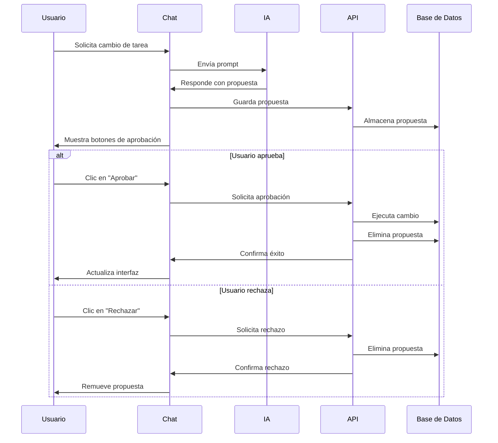

# Sistema de Propuestas de IA para Gestión de Tareas

## Descripción General

El sistema de propuestas permite que la IA genere sugerencias de cambios en las tareas y subtareas, las cuales requieren aprobación del usuario antes de ser aplicadas a la base de datos. Esto proporciona un control total sobre los cambios mientras aprovecha la inteligencia artificial para la gestión de tareas.

## Características Principales

### 1. Detección Automática de Propuestas
- La IA analiza las solicitudes del usuario y genera propuestas cuando detecta intenciones de modificar tareas
- Las propuestas se detectan mediante patrones específicos en la respuesta de la IA
- Sistema de parsing robusto que extrae datos estructurados de las respuestas

### 2. Interfaz de Aprobación
- Botones de "Aprobar" y "Rechazar" aparecen automáticamente en el chat
- Diseño visual claro que distingue las propuestas del contenido normal
- Estados de carga durante el procesamiento de las propuestas

### 3. Persistencia de Datos
- Las propuestas se almacenan temporalmente en la base de datos
- Sistema de limpieza automática de propuestas procesadas
- Integridad referencial con las tablas de usuarios y tareas

## Arquitectura del Sistema

### Componentes Principales

#### 1. Hook `useChatAI` (hooks/useChatAI.ts)
```typescript
interface ProposedChanges {
  id: string;
  type: "create" | "update" | "delete";
  entity: "task" | "subtask";
  data: any;
  originalData?: any;
  description: string;
}

// Funciones para manejar propuestas
const approveProposal = async (proposalId: string) => Promise<boolean>;
const rejectProposal = async (proposalId: string) => Promise<boolean>;
```

#### 2. Endpoints de API
- `POST /api/tasks/proposals/save` - Guardar propuesta
- `POST /api/tasks/proposals/approve` - Aprobar propuesta
- `POST /api/tasks/proposals/reject` - Rechazar propuesta

#### 3. Componente `ProposalButtons` (components/dashboard/ProposalButtons.tsx)
- Interfaz visual para aprobar/rechazar propuestas
- Muestra información contextual sobre la propuesta
- Estados de carga y feedback visual

### Flujo de Trabajo



## Formato de Propuestas

### Patrones de Detección
La IA genera propuestas usando patrones específicos:

```javascript
// Crear tarea
PROPUESTA_CREAR_TAREA: {
  "nombre": "Nombre de la tarea",
  "descripcion": "Descripción",
  "prioridad": "alta|media|baja",
  "fecha_limite": "YYYY-MM-DD",
  "estado": "pendiente|en proceso|terminado"
}

// Actualizar tarea
PROPUESTA_ACTUALIZAR_TAREA: {
  "id": 123,
  "nombre": "Nuevo nombre",
  "descripcion": "Nueva descripción",
  "prioridad": "alta|media|baja",
  "fecha_limite": "YYYY-MM-DD",
  "estado": "pendiente|en proceso|terminado"
}

// Eliminar tarea
PROPUESTA_ELIMINAR_TAREA: {
  "id": 123
}
```

### Estructura de Base de Datos

```sql
CREATE TABLE propuestas_pendientes (
    id VARCHAR(255) PRIMARY KEY,
    usuario_id INT NOT NULL,
    tipo ENUM('create', 'update', 'delete') NOT NULL,
    entidad ENUM('task', 'subtask') NOT NULL,
    datos JSON NOT NULL,
    descripcion TEXT NOT NULL,
    fecha_creacion TIMESTAMP DEFAULT CURRENT_TIMESTAMP,
    FOREIGN KEY (usuario_id) REFERENCES usuarios(id) ON DELETE CASCADE
);
```

## Configuración y Uso

### 1. Migración de Base de Datos
```bash
# Ejecutar el script de migración
mysql -u usuario -p base_de_datos < migration.sql
```

### 2. Configuración del Prompt
El sistema incluye un prompt mejorado que instruye a la IA sobre cómo generar propuestas:

```typescript
const systemPrompt = `
Eres un asistente de gestión de tareas. Puedes ayudar a crear, actualizar y eliminar tareas y subtareas.

INSTRUCCIONES PARA PROPUESTAS:
Cuando el usuario solicite cambios en las tareas, debes generar propuestas en el siguiente formato:
...
`;
```

### 3. Ejemplos de Uso

#### Solicitud de Creación
```
Usuario: "Crea una tarea llamada 'Revisar documentación' con prioridad alta"
IA: "Te ayudo a crear esa tarea. Aquí está mi propuesta:

PROPUESTA_CREAR_TAREA: {"nombre": "Revisar documentación", "descripcion": "", "prioridad": "alta", "estado": "pendiente"}"
```

#### Solicitud de Actualización
```
Usuario: "Cambia la prioridad de la tarea 5 a alta"
IA: "Actualizaré la prioridad de esa tarea:

PROPUESTA_ACTUALIZAR_TAREA: {"id": 5, "prioridad": "alta"}"
```

#### Solicitud de Eliminación
```
Usuario: "Elimina la tarea número 3"
IA: "Eliminaré esa tarea para ti:

PROPUESTA_ELIMINAR_TAREA: {"id": 3}"
```

## Seguridad y Validación

### 1. Autenticación
- Todas las operaciones requieren autenticación de usuario
- Las propuestas están vinculadas al usuario que las creó
- Validación de permisos en cada endpoint

### 2. Validación de Datos
- Verificación de campos obligatorios
- Validación de tipos de datos
- Sanitización de entrada de usuario

### 3. Integridad de Datos
- Transacciones para operaciones críticas
- Rollback automático en caso de errores
- Verificación de existencia de tareas antes de modificarlas

## Monitoreo y Logging

### 1. Logs de Actividad
```typescript
// Ejemplo de logging
console.log('Proposal created:', {
  id: proposal.id,
  userId: userId,
  type: proposal.type,
  timestamp: new Date().toISOString()
});
```

### 2. Métricas
- Número de propuestas generadas
- Tasa de aprobación/rechazo
- Tiempo promedio de procesamiento
- Errores por tipo de operación

## Troubleshooting

### Problemas Comunes

1. **Propuestas no se detectan**
   - Verificar formato del prompt de la IA
   - Revisar patrones de regex
   - Comprobar respuesta completa de la IA

2. **Errores de base de datos**
   - Verificar estructura de tabla
   - Comprobar permisos de usuario
   - Revisar logs de MySQL

3. **Botones no aparecen**
   - Verificar que la propuesta se guardó correctamente
   - Comprobar estado del componente
   - Revisar console para errores

### Debugging

```typescript
// Habilitar logs detallados
const { sendMessage } = useChatAI({
  onProposalCreated: (proposal) => {
    console.log('Proposal created:', proposal);
  },
});
```

## Mejoras Futuras

1. **Propuestas en Lote**
   - Permitir múltiples cambios en una sola propuesta
   - Interfaz para revisar cambios antes de aprobar

2. **Historial de Propuestas**
   - Vista de propuestas anteriores
   - Estadísticas de uso

3. **Notificaciones**
   - Alertas cuando hay propuestas pendientes
   - Recordatorios de propuestas no revisadas

4. **Templates de Propuestas**
   - Propuestas predefinidas para tareas comunes
   - Personalización por usuario

## Contribución

Para contribuir al sistema de propuestas:

1. **Nuevos tipos de propuestas**: Agregar patrones en `detectProposals()`
2. **Mejoras de UI**: Modificar `ProposalButtons.tsx`
3. **Validaciones**: Actualizar endpoints de API
4. **Testing**: Agregar casos de prueba

## Changelog

### v1.0.0
- Implementación inicial del sistema de propuestas
- Detección automática de propuestas en respuestas de IA
- Interfaz de aprobación/rechazo
- Persistencia en base de datos
- Integración con sistema de tareas existente 